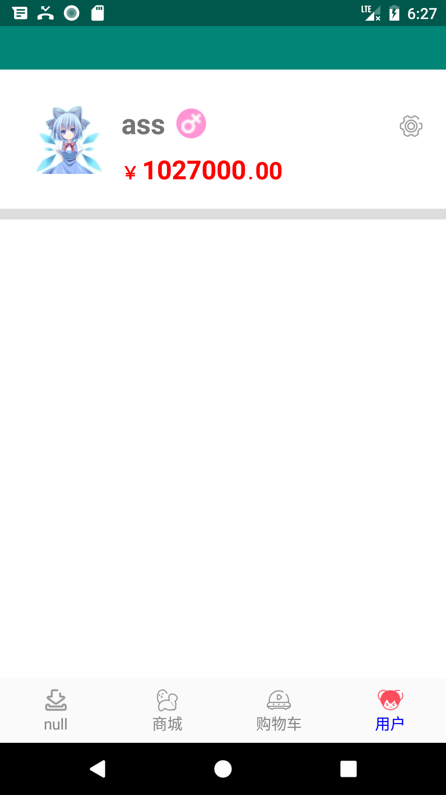
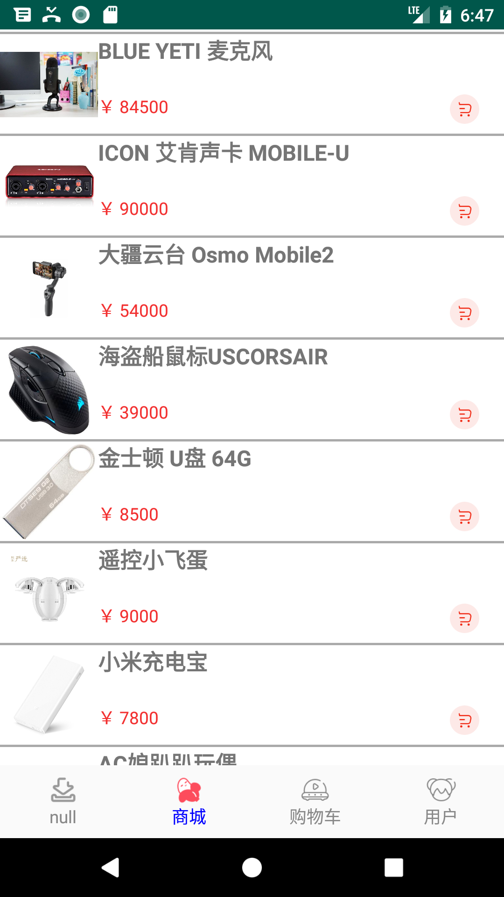
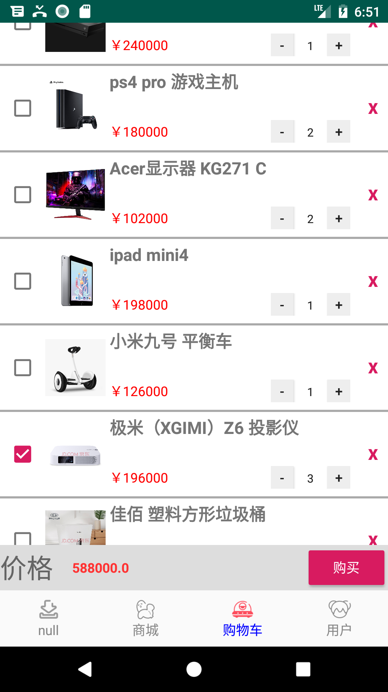
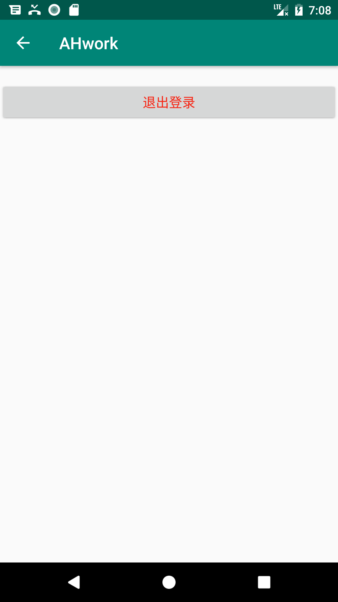
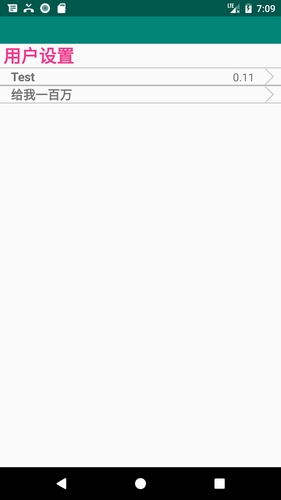
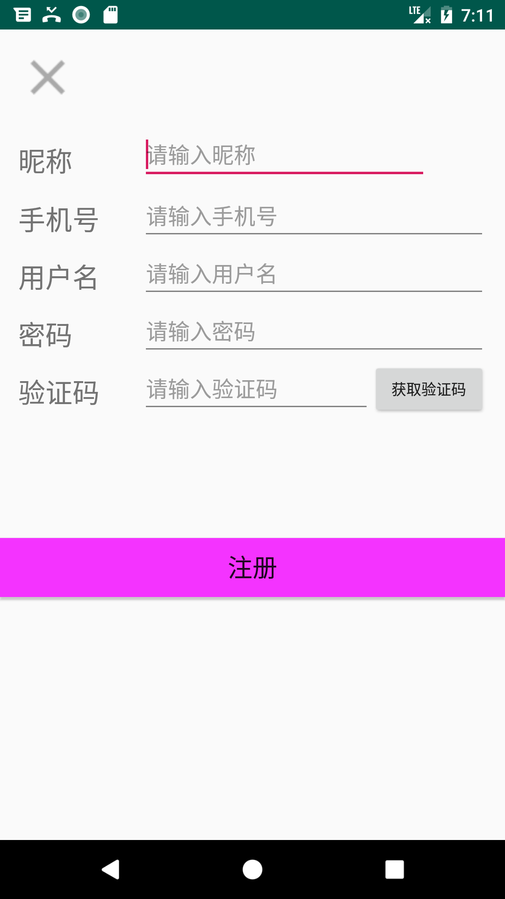
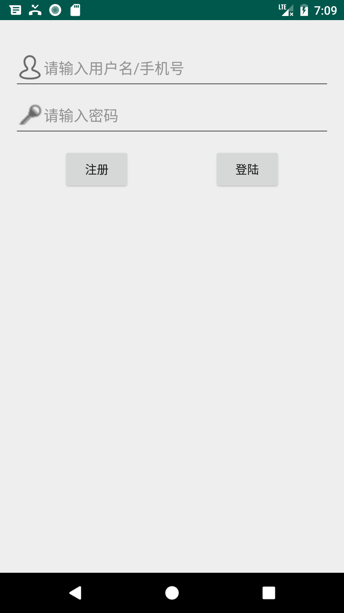

# 中文
本工程为Android编程第一学期的大作业，作业要求为：

1. 基于Android的购物APP系统设计与实现
    1. 登录功能：使用系统之前必须通过用户名和密码进行登录，在后台数据库有此用户名和密码才可以登录该系统，新的用户需要注册后才能登录。
    2. 系统主菜单：系统登录成功后进入系统主菜单，主菜单可以通过图形菜单的方式来展现系统的功能，单击某个选项便进入该功能的操作界面。
    3. 购物功能：对商品信息可进行添加、查询。(可根据需要自行定义修改、删除的功能) 
    4. 订单功能：可以计算出所购物品的总金额。
2.  自拟题目 

本工程完成的是第一项，并完成了所要求的功能。截图见结尾。

# English Translate
This project is a major assignment for the first semester of Android programming. The job requirements are:

1. Design and implementation of shopping APP system based on Android.
    1. Login function: Before using the system, you must log in with the user name and password. You can log in to the system after the user name and password in the background database. The new user needs to register before logging in.
    2. System main menu: After the system login is successful, enter the system main menu. The main menu can display the function of the system through the graphical menu. Click an option to enter the operation interface of the function.
    3. Shopping function: Add and query product information. (You can define the function of modification and deletion according to your needs)
    4. Order function: The total amount of the purchased items can be calculated.
2. Self-problem

This project completed the first item and completed the required functions. See the end of the screenshot.

